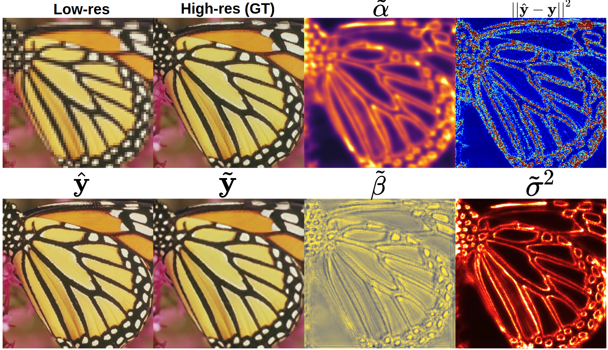

# BayesCap: Bayesian Identity Cap for Calibrated Uncertainty in Frozen Neural Networks
## [Arxiv paper]() || [Blog](https://www.eml-unitue.de/publication/BayesCap) || [HuggingFace Gradio Demo](https://huggingface.co/spaces/udion/BayesCap)

## Introduction


**Abstract.** High-quality calibrated uncertainty estimates are crucial for numerous real-world applications, especially for deep learning-based deployed ML systems. While Bayesian deep learning techniques allow uncertainty estimation, training them with large-scale datasets is an expensive process that does not always yield models competitive with non-Bayesian counterparts. Moreover, many of the high-performing deep learning models that are already trained and deployed are non-Bayesian in nature and do not provide uncertainty estimates. 
To address these issues, we propose **BayesCap** that learns a Bayesian identity mapping for the frozen model, allowing uncertainty estimation. **BayesCap** is a memory-efficient method that can be trained on a small fraction of the original dataset, enhancing pretrained non-Bayesian computer vision models by providing calibrated uncertainty estimates for the predictions without (i) hampering the performance of the model and (ii) the need for expensive retraining the model from scratch. The proposed method is agnostic to various architectures and tasks. We show the efficacy of our method on a wide variety of tasks with a diverse set of architectures, including image super-resolution, deblurring, inpainting, and crucial application such as medical image translation. Moreover, 
we apply the derived uncertainty estimates to detect out-of-distribution samples in critical scenarios like depth estimation in autonomous driving.


***TLDR:*** This is the official [PyTorch](https://pytorch.org/) implementation of BayesCap (from *ECCV 2022*) that allows estimating calibrated uncertainty for pre-trained (frozen) computer vision regression models in fast and efficient manner.

The structure of the repository is as follows:
```
BayesCap
|-ckpt/ (has all the checkpoints)
|-src/ (has all the codes and notebooks)
|-demo_examples/ (has some example images)
```

## Getting Started

The `src/` directory already provides all the code to load, train, and evaluate the SRGAN checkpoints along with the BayesCap checkpoint. In order to get started, first ensure that you have all the requirements as provided in `requirements.txt`, this can be setup by running
```
conda create --name <env> --file requirements.txt
```

The notebook `src/BayesCap_SRGAN_train_and_eval.ipynb` shows how to load the SRGAN checkpoint for the base model and how to train BayesCap for the same using the function,
```python
train_BayesCap(
	NetC,
	NetG,
	train_loader,
	test_loader,
	Cri = TempCombLoss(alpha_eps=1e-5, beta_eps=1e-2),
	device='cuda',
	dtype=torch.cuda.FloatTensor,
	init_lr=1e-4,
	num_epochs=20,
	eval_every=2,
	ckpt_path='../ckpt/BayesCap_SRGAN',
)
```

The following shows output of SRGAN and BayesCap for a sample input.


## Resources

We use the following resources to use as the base models (on top of which we train different BayesCap)

- SRGAN: [https://github.com/Lornatang/SRGAN-PyTorch](https://github.com/Lornatang/SRGAN-PyTorch)
- DeepFillv2: [https://github.com/csqiangwen/DeepFillv2_Pytorch](https://github.com/csqiangwen/DeepFillv2_Pytorch)
- Deblurring: [https://github.com/VITA-Group/DeblurGANv2](https://github.com/VITA-Group/DeblurGANv2)
- Medical Image Translation: [https://github.com/ExplainableML/UncerGuidedI2I](https://github.com/ExplainableML/UncerGuidedI2I) 
- MonoDepth: [https://github.com/nianticlabs/monodepth2](https://github.com/nianticlabs/monodepth2)

## BibTex

Please cite the following works 

```
@inproceedings{Upa_bayescap,
  title = {BayesCap: Bayesian Identity Cap for Calibrated Uncertainty in Frozen Neural Networks},
  author = {Upadhyay, U. and Karthik, S. and Chen, Y. and Mancini, M. and Akata, Z.},
  booktitle = {European Conference on Computer Vision (ECCV 2022)},
  year = {2022}
}
```

```
@inproceedings{upadhyay2021uncerguidedi2i,
  title={Uncertainty Guided Progressive GANs for Medical Image Translation},
  author={Upadhyay, Uddeshya and Chen, Yanbei and Hebb, Tobias and Gatidis, Sergios and Akata, Zeynep},
  booktitle={International Conference on Medical Image Computing and Computer-Assisted Intervention (MICCAI)},
  year={2021},
  organization={Springer}
}
```

```
@inproceedings{UpaCheAka21,
  title = {Robustness via Uncertainty-aware Cycle Consistency},
  author = {Upadhyay, U. and Chen, Y. and Akata, Z.},
  booktitle = {Advances in Neural Information Processing Systems 34 (NeurIPS 2021)},
  year = {2021}
}
```


